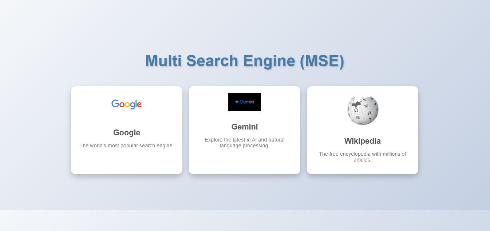

# Multi-Search Engine Interface

Multi-Search Engine Interface (MSE) is a web application that allows users to access multiple search engines like Google, Gemini, and Wikipedia from a single interface. It's designed to provide a seamless and user-friendly experience for exploring different search engines.

## Features

- **Google Search**: The world's most popular search engine for quick access to information.
- **Gemini Search**: Explore the latest in AI and natural language processing.
- **Wikipedia Search**: Access the free encyclopedia with millions of articles.

## Screenshots



## Live Demo

Access the live version of the Multi-Search Engine Interface here:

[Multi-Search Engine Interface - Live Demo](YOUR_HOSTING_LINK)

## Installation

To set up the project locally, follow these steps:

1. **Clone the repository:**

   ```bash
   git clone https://github.com/yourusername/multi-search-engine-interface.git
   cd multi-search-engine-interface
